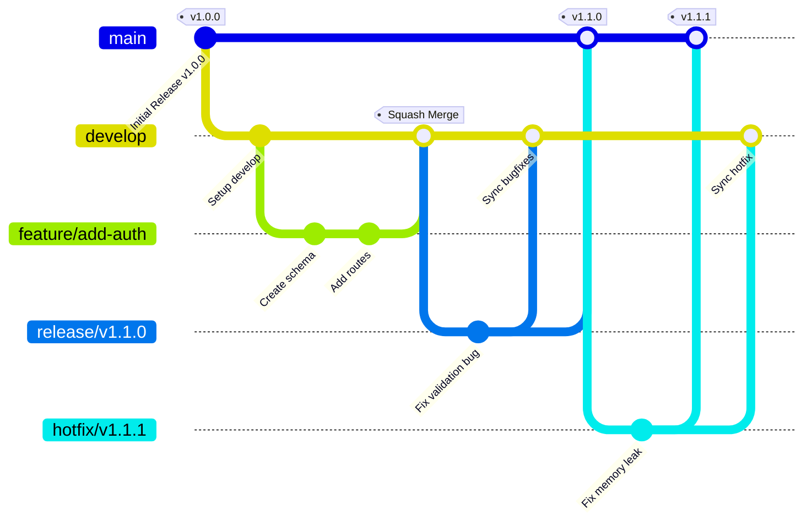
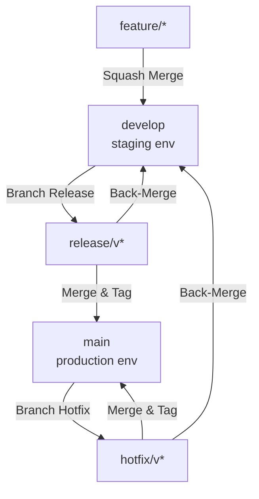

# Git Workflow and Versioning

## Overview

Git is your safety net. Treat commits as save points, branches as sandboxes, and history as documentation. With AI agents generating code at high speed, disciplined version control is the mechanism that keeps changes manageable, reviewable, and reversible.

## When to Use

Always. Every code change flows through git.

## Core Principles

### Trunk-Flow (Recommended)

This strategy combines the safety and release-control of **Git Flow** with the speed, automation, and continuous integration of **Trunk-Based Development**.

It separates development and production into two target environments, governed by automated check-gates and release/hotfix workflows:

1. **Develop Trunk (`develop`)**: The active development trunk. All new features and minor fixes are integrated here. Pushing or merging to `develop` triggers automated deployments to the **Develop/Staging Environment**.
2. **Production Trunk (`main` or `master`)**: Represents the live, production-ready code. Deployment to the **Production Environment** is triggered *exclusively* by tagging a commit on the `main` branch with a version tag (e.g., `v1.2.0`).



- **Feature flags over long-lived branches.** Merge incomplete work behind flags to keep `develop` stable and continuous.
- **Short-lived feature branches.** Feature branches target `develop` and must live for no more than 1-2 days to prevent code drift and ease merge conflict resolution.
- **Automated CI Gates.** Before code enters `develop`, automated linting, test suites, and build validations must pass.

### 1. Commit Early, Commit Often

Each successful increment gets its own commit. Don't accumulate large uncommitted changes.

```
Work pattern:
  Implement slice → Test → Verify → Commit → Next slice

Not this:
  Implement everything → Hope it works → Giant commit
```

Commits are save points. If the next change breaks something, you can revert to the last known-good state instantly.

### 2. Atomic Commits

Each commit does one logical thing:

```
# Good: Each commit is self-contained
git log --oneline
a1b2c3d Add task creation endpoint with validation
d4e5f6g Add task creation form component
h7i8j9k Connect form to API and add loading state
m1n2o3p Add task creation tests (unit + integration)

# Bad: Everything mixed together
git log --oneline
x1y2z3a Add task feature, fix sidebar, update deps, refactor utils
```

### 3. Descriptive Messages & Conventional Commits

When writing git commit messages, you MUST follow the Conventional Commits specification. Commit messages should explain the *why*, not just the *what*.

#### Format
`<type>[optional scope]: <description>`

`<optional body explaining why, not what>`

#### Allowed Types
- **feat**: A new feature
- **fix**: A bug fix
- **docs**: Documentation only changes
- **style**: Changes that do not affect the meaning of the code (white-space, formatting, etc)
- **refactor**: A code change that neither fixes a bug nor adds a feature
- **perf**: A code change that improves performance
- **test**: Adding missing tests or correcting existing tests
- **chore**: Changes to the build process or auxiliary tools and libraries such as documentation generation

#### Instructions
1. Analyze the changes to determine the primary `type`.
2. Identify the `scope` if applicable (e.g., specific component or file).
3. Write a concise `description` in imperative mood (e.g., "add feature" not "added feature").
4. If there are breaking changes, add a footer starting with `BREAKING CHANGE:`.

#### Examples
*   `feat(auth): implement login with google`
*   `fix(validation): resolve memory leak in phone parser`
*   `refactor(db): extract database connection pool utility`
*   `feat: add email validation to registration endpoint`
    
    Prevents invalid email formats from reaching the database.
    Uses Zod schema validation at the route handler level,
    consistent with existing validation patterns in auth.ts.

### 4. Keep Concerns Separate

Don't combine formatting changes with behavior changes. Don't combine refactors with features. Each type of change should be a separate commit — and ideally a separate PR:

```
# Good: Separate concerns
git commit -m "refactor: extract validation logic to shared utility"
git commit -m "feat: add phone number validation to registration"

# Bad: Mixed concerns
git commit -m "refactor validation and add phone number field"
```

**Separate refactoring from feature work.** A refactoring change and a feature change are two different changes — submit them separately. This makes each change easier to review, revert, and understand in history. Small cleanups (renaming a variable) can be included in a feature commit at reviewer discretion.

### 5. Size Your Changes

Target ~100 lines per commit/PR. Changes over ~1000 lines should be split. See the splitting strategies in `code-review-and-quality` for how to break down large changes.

```
~100 lines  → Easy to review, easy to revert
~300 lines  → Acceptable for a single logical change
~1000 lines → Split into smaller changes
```

## Branching Strategy & Environments

We support two primary environments mapping directly to our branching model:
*   **Develop/Staging Environment**: Connected to the `develop` branch. Any commit/merge to `develop` automatically deploys here.
*   **Production Environment**: Connected to the `main` (or `master`) branch. Deployments are triggered **only** when a release is tagged on `main` (e.g., `v1.0.0`).

### Branch Architecture

*   **`develop` (Active Trunk)**: The integration branch for developers and teams. Always stable and deployable to staging.
*   **`main` (Production Trunk)**: The production branch. Reflects live state.
*   **`feature/*`**: Short-lived branches off `develop` used for developing new features.
*   **`release/v*`**: Short-lived branches off `develop` to stabilize a release (only bugfixes allowed here, then merged to `main` with a version tag and back to `develop`).
*   **`hotfix/v*`**: Short-lived branches off `main` to address critical production issues. Merged to `main` with a new version tag and merged back to `develop`.



### Branch Naming Conventions

Maintain strict branch naming so automation and CI systems can route and validate appropriately:

*   `feature/<description>` (e.g., `feature/user-auth`) - Target: `develop`
*   `fix/<description>` (e.g., `fix/token-expiry`) - Target: `develop`
*   `release/v<semver>` (e.g., `release/v2.1.0`) - Target: `main` & `develop`
*   `hotfix/v<semver>` (e.g., `hotfix/v2.1.1`) - Target: `main` & `develop`
*   `chore/<description>` (e.g., `chore/dependency-upgrade`) - Target: `develop`
*   `refactor/<description>` (e.g., `refactor/payment-gateway`) - Target: `develop`
```

## Working with Worktrees

For parallel development work, use git worktrees to run multiple branches simultaneously:

```bash
# Create a worktree for a feature branch branching off develop
git worktree add ../project-feature-a feature/task-creation
git worktree add ../project-feature-b feature/user-settings

# Each worktree is a separate directory with its own branch
# Developers can work in parallel without interfering
ls ../
  project/              ← develop branch (integration workspace)
  project-feature-a/    ← feature/task-creation branch (sandbox A)
  project-feature-b/    ← feature/user-settings branch (sandbox B)

# When done, merge and clean up
git worktree remove ../project-feature-a
```

Benefits:
- Multiple agents can work on different features simultaneously
- No branch switching needed (each directory has its own branch)
- If one experiment fails, delete the worktree — nothing is lost
- Changes are isolated until explicitly merged

## The Save Point Pattern

```
Agent starts work
    │
    ├── Makes a change
    │   ├── Test passes? → Commit → Continue
    │   └── Test fails? → Revert to last commit → Investigate
    │
    ├── Makes another change
    │   ├── Test passes? → Commit → Continue
    │   └── Test fails? → Revert to last commit → Investigate
    │
    └── Feature complete → All commits form a clean history
```

This pattern means you never lose more than one increment of work. If an agent goes off the rails, `git reset --hard HEAD` takes you back to the last successful state.

## Change Summaries

After any modification, provide a structured summary. This makes review easier, documents scope discipline, and surfaces unintended changes:

```
CHANGES MADE:
- src/routes/tasks.ts: Added validation middleware to POST endpoint
- src/lib/validation.ts: Added TaskCreateSchema using Zod

THINGS I DIDN'T TOUCH (intentionally):
- src/routes/auth.ts: Has similar validation gap but out of scope
- src/middleware/error.ts: Error format could be improved (separate task)

POTENTIAL CONCERNS:
- The Zod schema is strict — rejects extra fields. Confirm this is desired.
- Added zod as a dependency (72KB gzipped) — already in package.json
```

This pattern catches wrong assumptions early and gives reviewers a clear map of the change. The "DIDN'T TOUCH" section is especially important — it shows you exercised scope discipline and didn't go on an unsolicited renovation.

## Pre-Commit Hygiene

Before every commit:

```bash
# 1. Check what you're about to commit
git diff --staged

# 2. Ensure no secrets
git diff --staged | grep -i "password\|secret\|api_key\|token"

# 3. Run tests
npm test

# 4. Run linting
npm run lint

# 5. Run type checking
npx tsc --noEmit
```

Automate this with git hooks:

```json
// package.json (using lint-staged + husky)
{
  "lint-staged": {
    "*.{ts,tsx}": ["eslint --fix", "prettier --write"],
    "*.{json,md}": ["prettier --write"]
  }
}
```

## Handling Generated Files

- **Commit generated files** only if the project expects them (e.g., `package-lock.json`, Prisma migrations)
- **Don't commit** build output (`dist/`, `.next/`), environment files (`.env`), or IDE config (`.vscode/settings.json` unless shared)
- **Have a `.gitignore`** that covers: `node_modules/`, `dist/`, `.env`, `.env.local`, `*.pem`

## Using Git for Debugging

```bash
# Find which commit introduced a bug
git bisect start
git bisect bad HEAD
git bisect good <known-good-commit>
# Git checkouts midpoints; run your test at each to narrow down

# View what changed recently
git log --oneline -20
git diff HEAD~5..HEAD -- src/

# Find who last changed a specific line
git blame src/services/task.ts

# Search commit messages for a keyword
git log --grep="validation" --oneline
```

## Common Rationalizations

| Rationalization | Reality |
|---|---|
| "I'll commit when the feature is done" | One giant commit is impossible to review, debug, or revert. Commit each slice. |
| "The message doesn't matter" | Messages are documentation. Future you (and future agents) will need to understand what changed and why. |
| "I'll squash it all later" | Squashing destroys the development narrative. Prefer clean incremental commits from the start. |
| "Branches add overhead" | Short-lived branches are free and prevent conflicting work from colliding. Long-lived branches are the problem — merge within 1-3 days. |
| "I'll split this change later" | Large changes are harder to review, riskier to deploy, and harder to revert. Split before submitting, not after. |
| "I don't need a .gitignore" | Until `.env` with production secrets gets committed. Set it up immediately. |

## Red Flags

- Large uncommitted changes accumulating
- Commit messages like "fix", "update", "misc"
- Formatting changes mixed with behavior changes
- No `.gitignore` in the project
- Committing `node_modules/`, `.env`, or build artifacts
- Long-lived branches that diverge significantly from main
- Force-pushing to shared branches

## Verification

For every commit:

- [ ] Commit does one logical thing
- [ ] Message explains the why, follows type conventions
- [ ] Tests pass before committing
- [ ] No secrets in the diff
- [ ] No formatting-only changes mixed with behavior changes
- [ ] `.gitignore` covers standard exclusions